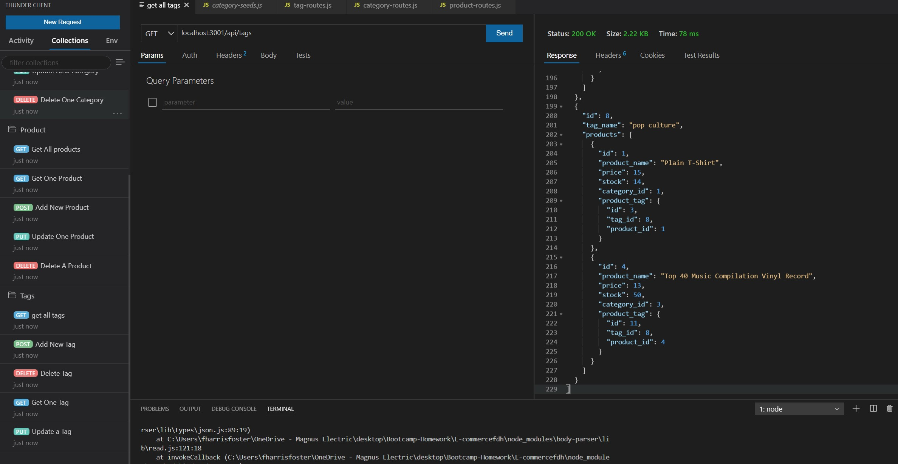

# E-commerce Back End Starter Code

As a manager at an internet retail company, a back end e-commerce website that uses the latest technologies was created for companies to compete with other e-commerce companies. 
To create this website, a functional Express. Js. API was used.  A database name, MYSQL Workbench username, and password to an environment variable file.  Then they can connect to a database using sequelize. When the schema and seed commands are entered then a development database is created and seeded with test data.  Once a command is entered to invoke the application, then the server is started and the sequelize models are synced to the MYSQL workbench database.  

Thunder client was used to create all GET routes for categories, products, or tags.  Data is entered for each of these routes and is displayed in a formatted JSON.  Then the API POST, PUT, and DELETE routes are created then the company is able to successfully create, update, and delete data in the database. 

The following walkthrough will demonstrate the sample database created. 

## Table of Contents

- [Installation](#installation)
- [Usage](#usage)
- [Roadmap](#roadmap)
- [Contributions](#contributions)
- [Questions](#questions)

## Installation

github: https: https://github.com/harrisfd/E-commercefdh

## Usage/Walkthrough Video

http://somup.com/crhjhFFGXH

## Roadmap
Continue to update the database with new functionalities that will improve performance and help companies remain competitive.

## Contributions

No contributions at this time.

## Questions

Please email fharrisfoster@gmail.com for any questions.
